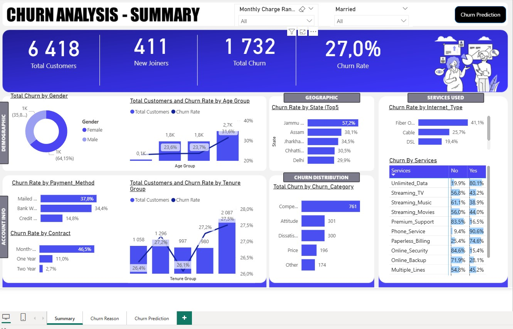
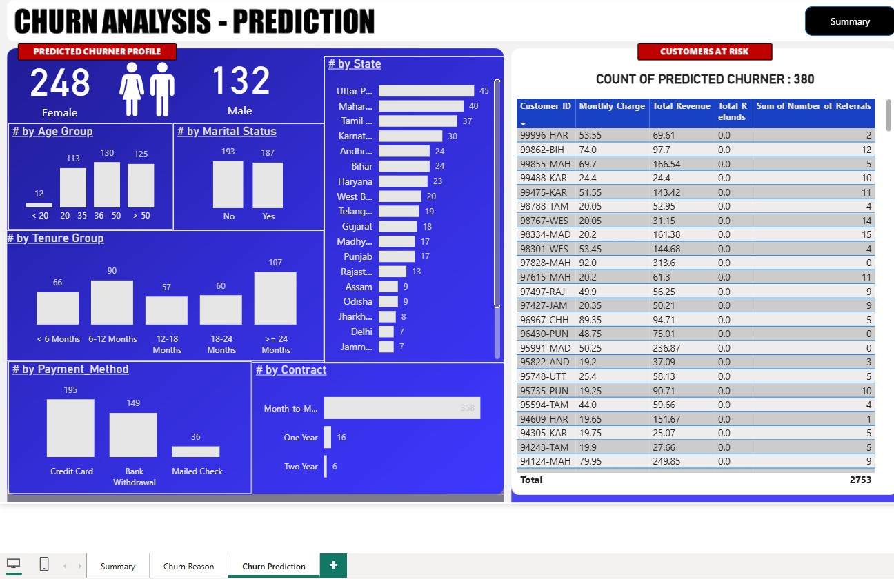

# 🧠 Customer Churn Prediction

A project focused on analyzing and predicting customer churn using Machine Learning (Random Forest), SQL, and Power BI.

---

## 📌 Project Goal

To identify customers with a high probability of churn based on historical data and provide business stakeholders with actionable insights through visual analytics and predictive modeling.

---

## 🔧 Technologies Used

- 📊 **Power BI** — to visualize key business metrics and churn patterns
- 🐍 **Python (Pandas, scikit-learn)** — for data preprocessing and model training
- 🗄️ **SQL (T-SQL)** — to extract and prepare data from source systems
- 🌲 **Random Forest** — classification model to predict churn likelihood
- 📈 **Seaborn/Matplotlib** — to visualize feature importance and model insights

---

## 📁 Project Structure

| Folder / File         | Description                                   |
| --------------------- | --------------------------------------------- |
| `ml_model/`           | Jupyter notebook, predictions, visualizations |
| `sql/`                | SQL scripts for data extraction               |
| `data/`               | Sample input data and prediction results      |
| `Churn Analysis.pbix` | Power BI dashboard                            |
| `README.md`           | Project overview and documentation            |

---

## 📊 Power BI Dashboard

📁 File: `Churn Analysis.pbix`  
Dashboard Screenshot:




> If you're unable to open `.pbix`, refer to screenshots or demo video (see below).

---

## 🧪 Machine Learning Model

- **Algorithm**: Random Forest Classifier
- **Target Variable**: `Customer_Status` (`Stayed` / `Churned`)
- **Performance Metrics**:
  - Accuracy: **84%**
  - F1-score (Churned): **70%**
  - ROC AUC: ~**0.84**

---

## 🛠️ How to Run the Project

1. Install the required Python libraries:

```bash
pip install pandas numpy scikit-learn openpyxl seaborn matplotlib
```

2. Open the Jupyter Notebook:
   jupyter notebook ml_model/Churn_Prediction.ipynb

The notebook includes:

Data preprocessing

Model training & evaluation

Feature importance plot

Predictions on new data
